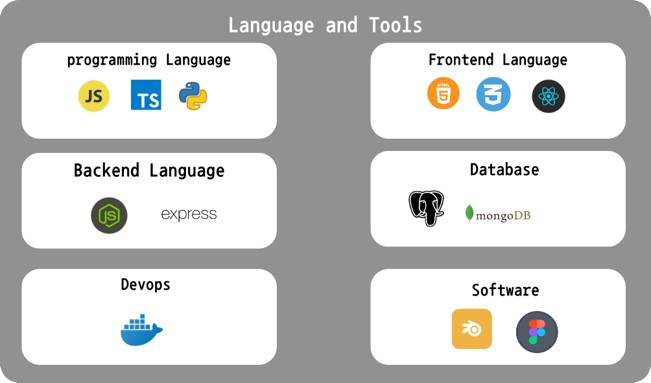

<h1 align="center">Hi 👋, I'm Avinash Boruah</h1>
<h3 align="center">A passionate software developer from India</h3>

  

  
  

### 📊 **GitHub Stats**

  

  &nbsp;

---

<h1 align="center">Get in Touch</h1>

  
  

